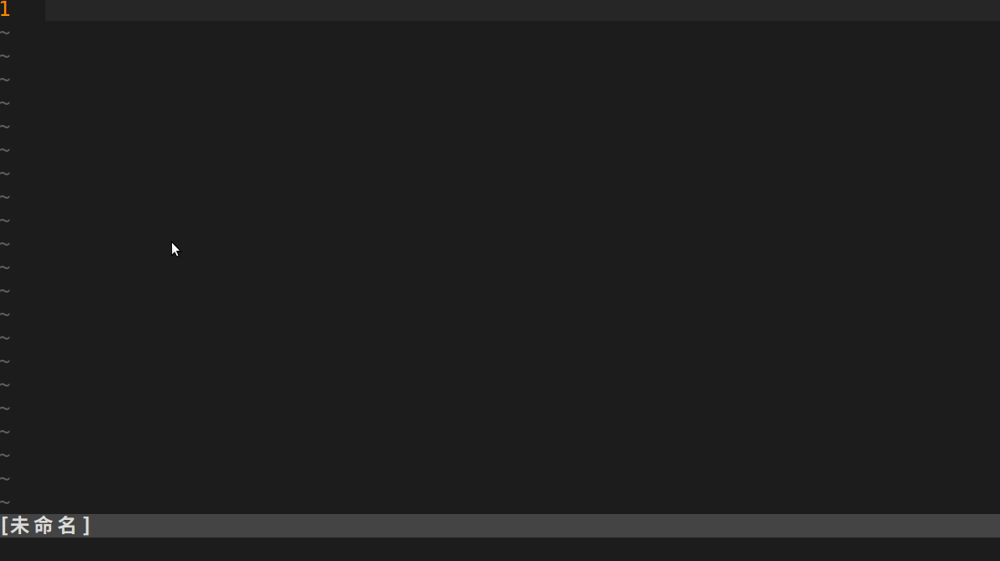
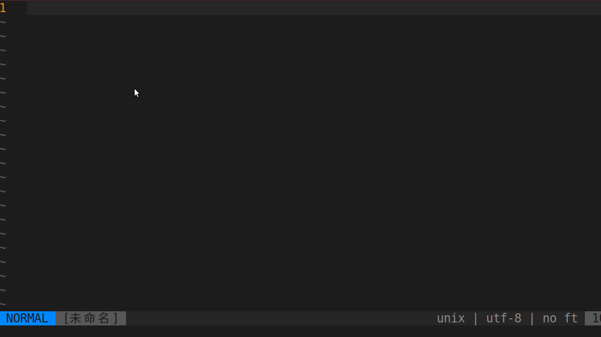
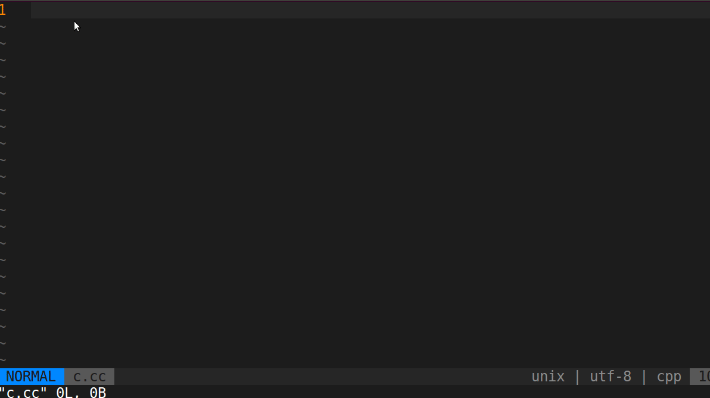
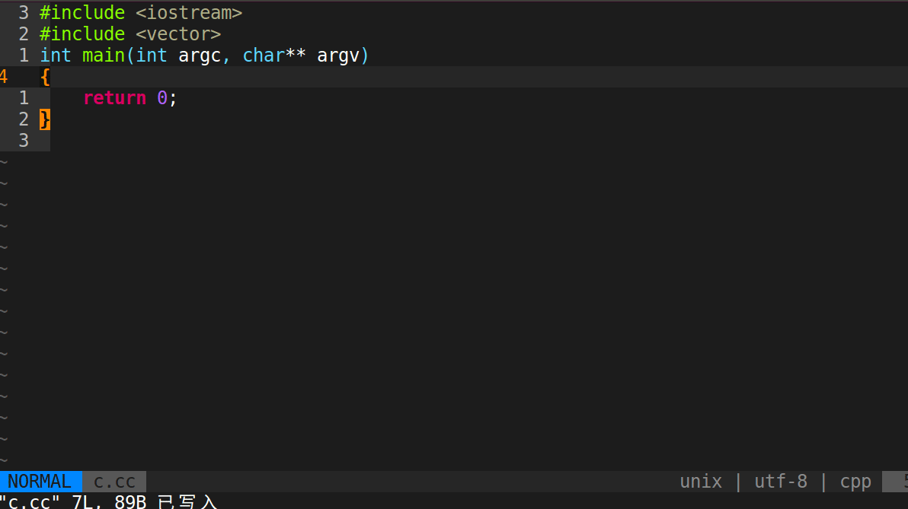
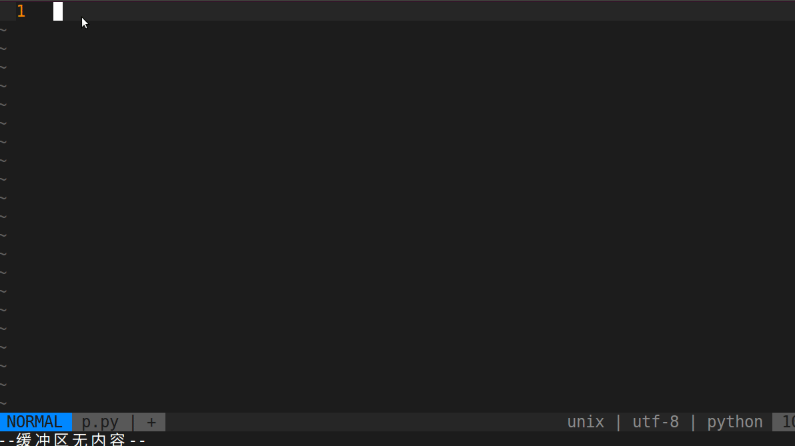
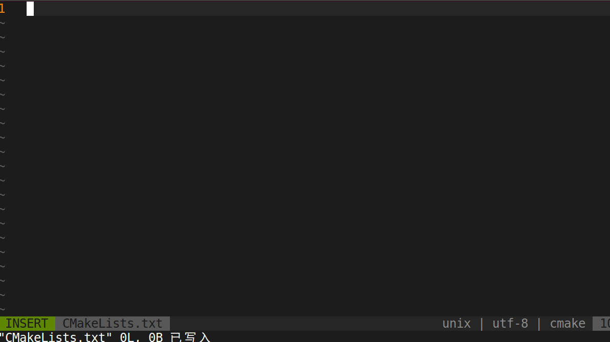
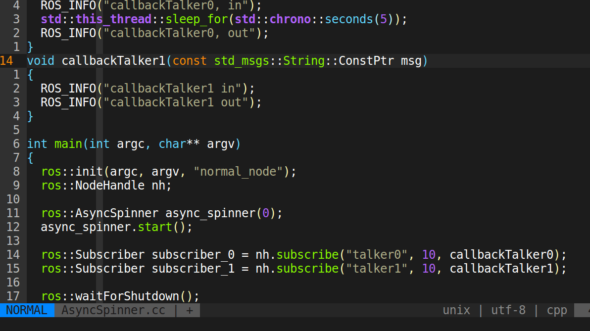
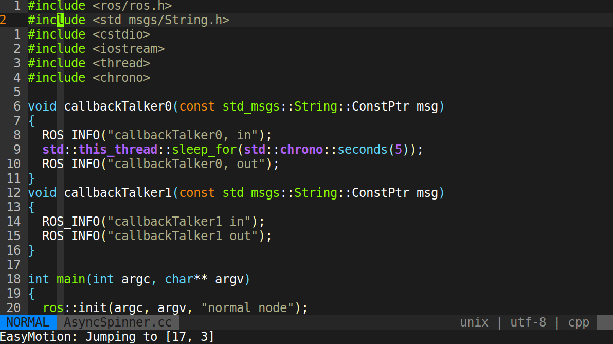
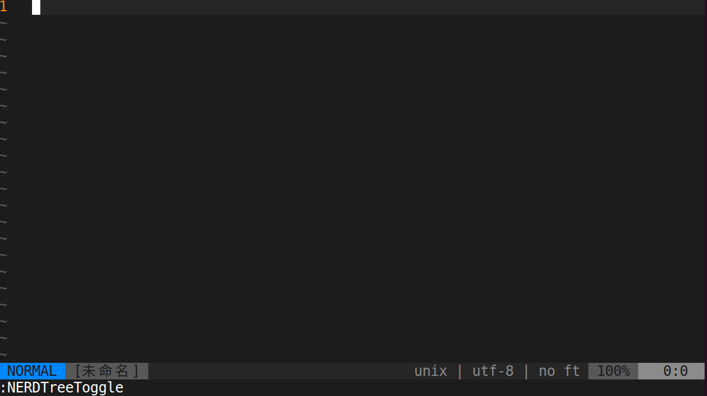
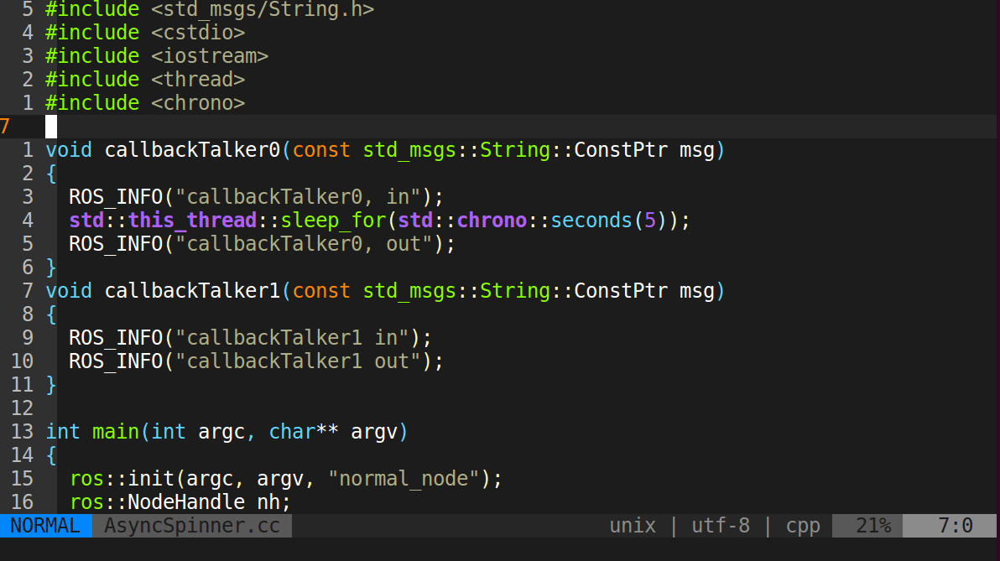

# 0. 新年快乐

来到2021年啦, 祝大家新年快乐.

在周末的时间将目前的vim插件以及配置进行整理. 给出了安装脚本和详细的使用说明.

vim 8.2版本已经发布, 加入了新的特性**Pop Up Windows**的特性. 使之具备了类似VSCode的提示窗的特性.

最重要的自动补全插件由[YouCompleteMe](https://github.com/ycm-core/YouCompleteMe.git)改成[coc.nvim](https://github.com/neoclide/coc.nvim.git), 使用更加方便. 

依托coc.nvim, 该配置支持C++/Python/JavaScript等语言的语义分析和补全.

# 1. 文件目录介绍


# 2. 安装

* 部署环境

```
./deploy.sh
```

* 安装插件

```
vim -c PlugInstall
```

* 安装Coc拓展

```
再次进入vim, 自动进行安装Coc拓展
```

* 检查

```
打开C++/Python文件, 查看补全功能
```


# 3. 功能介绍

## 3.1 快捷键说明

| 快捷键 | 功能 | 快捷键 | 功能 | 
| ---- | ---- | ---- | ---- |
| Space | Leader键 | Ctrl+p | 在当前目录中快速查找文件 |
| Ctrl+j | 窗口间光标跳转---向下 | Ctrl+f | 快速查找函数 |
| Ctrl+k | 窗口间光标跳转---向上 | Ctrl+i | 在MRU中快速查找 |
| Ctrl+h | 窗口间光标跳转---向左 | Ctrl+d | 向下快速翻页 |
| Ctrl+l | 窗口间光标跳转---向右 | Ctrl+u | 向上快速翻页 |
| \<Leader\>\<Leader\>e | (空格空格e)前向快速移动 | \<Leader\>t | 翻译光标在处英文 |
| \<Leader\>\<Leader\>b | 后向快速移动 | \<Leader\>f | 全局搜索光标处字段 |
| \<Leader\>\<Leader\>j | 前向行快速移动 | \<Leader\>b | 快速搜索Buffer |
| \<Leader\>\<Leader\>k | 后向行快速移动 | \<Leader\>h | 快速搜索历史命令 |
| \<Leader\>\<Leader\>m | 高亮光标处单词 | | |
| F7 | 格式化C系代码 | | |
| F10 | 开闭目录树窗口 | | |
| F12 | 开闭函数结构窗口 | | |
| m | 高亮光标所在的单词 | | |
| ci | 注释所在行/块 | | |

## 3.2 特色功能

插件安装 [手动安装 :PlugInstall]



文件搜索 [快捷键 Ctrl+P] 



代码段补全 [来自coc-snippet]



C++语法解析补全 [来自coc language server: ccls]



Python语法解析补全 [来自coc language server: jedi]



CMake语法补全 [快捷键 Shift+K]




注释代码 [快捷键 ci]



快速移动 [来自easy-motion 快捷键 \<Leader\>\<Leader\>e \<Leader\>\<Leader\>b]



目录树 [快捷键 F10]



函数表搜索 [快捷键 Ctrl+F]



> [快速部署科学上网链接](https://邀请01.很有精神.com/auth/register?code=gCCw)
